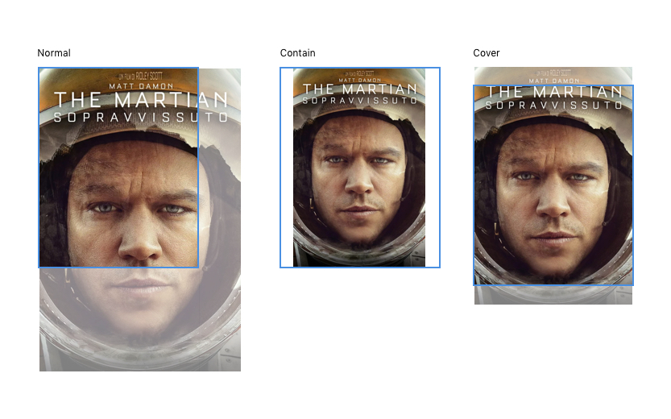

Image View
=============

A simple view that helps to manage the loading of image and adjusts the image to its container.




## API

### Methods

#### initialize([options])


Options:

- `src` Specifies the URL of an image.
- `placeholder` this is the temporary image. The default is a transparent one pixel image.
- `size` fits the image to its container. Values:
   - `auto`: if the image is vertically will apply the `cover` style horizontal otherwise if you will apply the` contain` style.
   - `normal`: the image is not resized.
   - `contain`: the image is scaled using the longest side.
   - `cover`: the image is scaled in the short side of the image.
- `worker` Default: `false`.
- `className` name of CSS class. Default: `image`.
- `position` it indicates how to place the image. It will be used as `className`. The values are `center` or `top-left`. Default: `center`.
- `viewport` it is the viewport image. Default is the container itself. The object must be: `{ width: <number>, height: <number> }`.

#### width([value])
If `value` is undefined than return the `width` image. Otherwise set the width.

#### height([value])
If `value` is undefined than return the `height` image. Otherwise set the height.


## Usage

```javascript

var BaseView  = require('backbone.uikit').BaseView;
var ImageView = require('backbone.uikit').ImageView;

var MyView = BaseView.extend({

	addClass: 'my-view',

	initialize: function(){
		MyView.__super__.initialize.apply(this, arguments);

		this.views.coverImage = new ImageView({
			src: 'http://placehold.it/350x150',
			placeholder: 'img/placeholder-cover-image.png',
			size: 'auto',
			viewport: { width: 250, height: 100 }
		});

	},

	render: function () {

		this.$el.empty().append( this.views.coverImage.el );
		this.views.coverImage.render();

		return this;
	}
}

```

### HTML generated

```html

<figure class="image center" >
	
</figure>

```

### SCSS applied

```scss

.image{
	position: relative;
	width: 100%;
	height: 100%;

	&.center img{
		position: absolute;
		display: block;
		top: 50%;
		left: 50%;
	}

	&.top-left img{
		display: block;
		margin-top: 0 !important;
		margin-left: 0 !important;
	}

}
```
