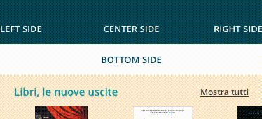

Scroll Bar View
=============

Aggiunge ad [OsBarView](OsBarView.md) una bottom bar che segue lo scroll di un
elemento passato come opzione.



## API

### Options

#### bottom: `View`, `$`, `DOMNode`, `string` (es. `<div>`).
Contenuto da inserire nel `BOTTOM SIDE`.

#### fadeBottomBackground: `Boolean`
Default `false`. Anima l'opacità del background assieme allo scroll.

#### inverseBottomFading: `Boolean`
Default `false`. Inverte l'animazione di `fadeBottomBackground`.

#### resize: `Boolean`
Default `true`. Ridimensiona il `BOTTOM SIDE` rispetto a `LEFT SIDE` e `RIGHT SIDE`.

#### scroll: `Boolean`
Default `true`. Abilita lo scroll.

#### scrollElement: `View`, `$`, `DOMNode`
L'elemento esterno alla scroll bar a cui agganciare l'evento scroll.

#### scrollUpHeight: `Integer`
Default `44`. Altezza in pixel della `BOTTOM SIDE` nello stato `STATUS_SCROLL_UP`.

**NOTA: modificare anche il CSS in accordo con quanto impostato in questa opzione**

#### scrollDownHeight: `Integer`
Default `44`. Altezza in pixel della `BOTTOM SIDE` nello stato `STATUS_SCROLL_DOWN`.

**NOTA: modificare anche il CSS in accordo con quanto impostato in questa opzione**

#### bounce: `auto`, `on`, `off`
Default `auto`. Abilita l'effetto bounce al termine dello scroll.

- **auto**: abilita il bounce solo quando lo stato passa da `STATUS_SCROLL_DOWN` a `STATUS_SCROLL_UP`
- **on**: abilita il bounce a prescindere dallo stato
- **off**: bounce disabiltiato

#### scrollBounceRange: `Integer`
Default `120`. Dimensione in pixel entro il quale lo scroll dovrà risposizionarsi.

#### initialStatus: `STATUS_SCROLL_DOWN`, `STATUS_SCROLL_UP`
Default `STATUS_SCROLL_DOWN`. Posizione iniziale di `BOTTOM SIDE`.

**Nota: se `STATUS_SCROLL_UP` lo `scrollElement` deve essere scrollabile all'evento `onRender` della `ScrollBarView`**


### Methods

#### setScroller(scrollElement: `View`, `$`, `DOMNode`)
Imposta l'elemento su cui rimanere in ascolto dell'evento scroll.

#### changeStatus(newStatus: `STATUS_SCROLL_DOWN`, `STATUS_SCROLL_UP`, [options])
Cambia lo stato della `ScrollBarView`.

**options**
- **execute**: Default `true`. Scatena lo scroll dell `ScrollBarView` a seconda dello stato.
- **silent**: Default `false`. Disabilita il trigger dell'evento `change:status`.


### Events

#### `change:status` => (newStatus: `STATUS_SCROLL_DOWN`, `STATUS_SCROLL_UP`)
Eseguito al cambio di stato.


## Usage

```javascript

import { ScrollBarView, PageView } from "backbone.uikit";

export default class MyPage extends PageView {

	constructor(options){
		super(options);

		let state = this.getState();

		let scrollBarView = new ScrollBarView({
			state: state,
			scrollElement: this.$el
			// resize:               true,     // resize width based on left-side and right-side
			// scroll:               true,     // make the bottom-side scroll over the nav-bar
			// scrollElement:        null,     // element to listen for scroll events
			// scrollUpHeight:       44,       // bottom-side height when scrolled up
			// scrollDownHeight:     44,       // bottom-side height when scrolled down
			// scrollBounceRange:    120,      // when scroll falls in this range trigger scroll bounce animation
			// initialStatus:        STATUS_SCROLL_DOWN, // bottom-side initial position
			// bottom:               null,	    // View, el, $
			// fadeBottomBackground: false,    // bottom-side-background fading animation
			// inverseBottomFading:  false,    // fade bottom-side-background when scrolling down (false) or up (true)
			// bounce:               "auto"    // "auto": bounce only when status change from SCROLL_DOWN to SCROLL_UP
											// "on":   bounce also when status is already SCROLL_UP
											// "off";  never bounce
		});
		this.addSubView('scrollBarView', scrollBarView);
	}

	getNavigationBar() {
		return this.getSubView('scrollBarView');
	}

	onRender(rendered){
		if (!rendered) {
			this.$el.html('<div style="height: 1000px">Here my scrollable content</div>');
		}
	}

}

```
